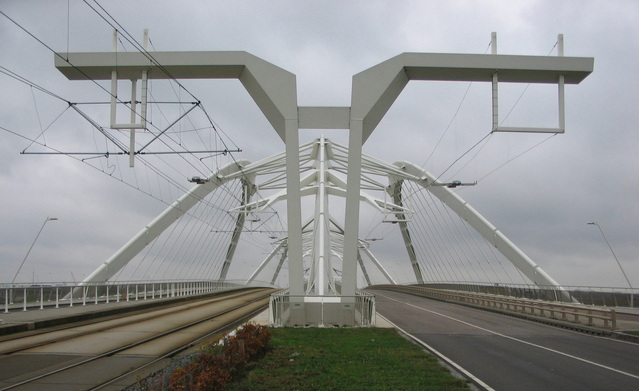
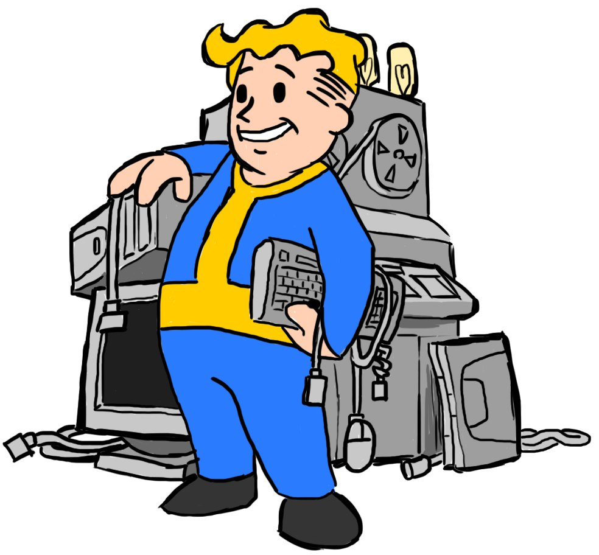
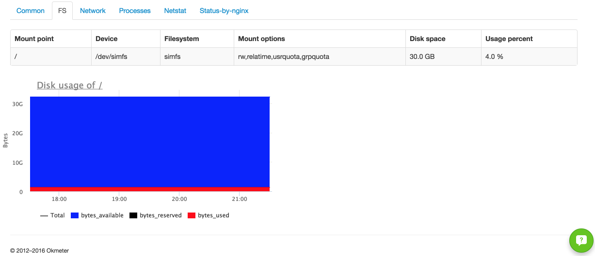

---

layout: default

---

# &nbsp;

## **{{ site.presentation.title }}** {#cover}

	
{{ site.author.name }}

## Инфраструктура

  

## История проекта

{:.right-image}

Один стартап, магазин дискет

## История проекта

### Стадия 1

  * Один разработчик
  * Один сервер
  * Код в репозитории на GitHub

## История проекта

### Стадия 1

  * `npm test`
  * `git merge feature && git push origin master`
  * `ssh floppy.shop`
  * `git pull origin master`
  * `make && make install`

## История проекта

### Стадия 2

Нужно больше фич. Добавляются разработчики

  * Каждому нужно настраивать окружение
  * Никто не должен забывать про тесты
  * Нужно договариваться о деплое

## История проекта

### Стадия 2

  * Vagrant – виртуальные окружения
  * Merge только через пулл-реквесты
  * Код-ревью пулл-реквестов
  * Continuous Integration – проверки, тесты
  * Continuous Deployment

## История проекта

### Стадия 3

Нагрузка выросла

Единственный сервер не справляется

## История проекта

### Стадия 3

Добавили 4 сервера

В скрипте деплоя операция в цикле

## История проекта

### Стадия 4

Печаль-беда, откатываем релиз!

О_о

  * `ssh serv1.floppy.shop`
  * `git checkout 4f230ff`
  * `make && make install`

И это на всех серверах

## История проекта

### Стадия 4

Автоматизация отката релиза

Версионирование релизов

## История проекта

### Стадия 5

Слушайте, а у нас 2 сервера лежат уже 3 дня…

## История проекта

### Стадия 5

Мониторинг с оповещениями

## И жили они долго и счастливо
{:.screen-shot}

  

## &nbsp;
{:.section}

### Задачи инфраструктуры

## Задачи инфраструктуры

  * Хостинг
  * Инструментарий разработки
  * Корректная интеграция изменений
  * Быстрая доставка фич
  * Релизный цикл с возможностью отката
  * Мониторинг здоровья сервиса

## &nbsp;
{:.section}

### Хостинг

## Хостинг

  * Реальное железо
  * Облачные платформы:
    * Infrastructure-as-a-Service – низкий уровень: машины, сети
    * Platform-as-a-Service – высокий уровень: приложения, функции

## &nbsp;
{:.section}

### Инструментарий разработки

## Инструментарий разработки

Разработчикам нужно совместно работать над кодом,
нужно выполнять этот код

  * Система и хостинг контроля версий:
    * Git – GitHub, BitBucket, GitLab
    * Mercurial – BitBucket
  * Воссоздаваемое окружение
    * Vagrant
    * Otto
    * Docker Compose
  * Многое других направлений, тысячи их

## &nbsp;
{:.section}

### Интеграция изменений

## Интеграция изменений

Нужно понять, что изменения не вносят багов,
прежде чем вливать в основную ветку

  * Continuous Integration
    * Сборка
    * Автоматизированные тесты
    * Дополнение ручным тестированием:
      * Выкладка проекта на тестовые сервера
      * Ручное тестирование
  * Continuous Deployment – дополнение выкладкой в бой

## Интеграция изменений

<table style="text-align: center">
  <tr>
    <td style="vertical-align: middle"></td>
    <td style="vertical-align: middle"></td>
    <td style="vertical-align: middle"></td>
  </tr>
  <tr style="padding: 10px !important">
    <td>Travis CI</td>
    <td>Jenkins</td>
    <td>TeamCity</td>
  </tr>
</table>

## &nbsp;
{:.section}

### Релизный цикл с возможностью отката

## Релизный цикл с возможностью отката

Версионирование релизов

  

## Релизный цикл с возможностью отката

[github.com/shipitjs/shipit](https://github.com/shipitjs/shipit)

&nbsp;
&nbsp;

  * В проекте `shipitfile.js`
  * Деплой: `shipit production deploy`
  * Откат: `shipit production rollback`

## Релизный цикл с возможностью отката

{:.right-image}

На Heroku – Git для продакшен-кода:

  * `heroku git:remote -a proj-id`
  * `git push heroku master`

## Релизный цикл с возможностью отката

Пакеты операционных систем

  

## &nbsp;
{:.section}

### Мониторинг проекта

## Мониторинг проекта

  * Проверка доступности сервиса
  * Анализ показателей на предмет аномалий

## Проверка доступности сервиса

[metrika.yandex.ru](https://metrika.yandex.ru)

## Яндекс.Метрика
{:.screen-shot}

## Проверка доступности сервиса

[uptimerobot.com](https://uptimerobot.com)

## Uptime Robot
{:.screen-shot}

## Анализ показателей на предмет аномалий

[okmeter.io](https://okmeter.io)

## OkMeter
{:.screen-shot}

## OkMeter

## OkMeter

## OkMeter

## OkMeter

## OkMeter

## OkMeter

## OkMeter

## &nbsp;
{:.section}

### Заключение

## Инфраструктура

<table>
  <tr>
    <td>Железо, системное ПО</td>
    <td><input type="checkbox" style="vertical-align: middle" checked=""> <label style="vertical-align: middle">Хостинг</label></td>
  </tr>
  <tr>
    <td>Инструментарий разработки</td>
    <td><input type="checkbox" style="vertical-align: middle" checked=""> <label style="vertical-align: middle">GitHub, Vagrant и т. д.</label></td>
  </tr>
  <tr>
    <td>Корректная интеграция изменений</td>
    <td><input type="checkbox" style="vertical-align: middle" checked=""> <label style="vertical-align: middle">Travis CI, Jenkins, TeamCity</label></td>
  </tr>
  <tr>
    <td>Быстрая доставка фич</td>
    <td><input type="checkbox" style="vertical-align: middle" checked=""> <label style="vertical-align: middle">Автотесты, Continuous Deployment</label></td>
  </tr>
  <tr>
    <td>Релизный цикл с возможностью отката</td>
    <td><input type="checkbox" style="vertical-align: middle" checked=""> <label style="vertical-align: middle">ShipIt</label></td>
  </tr>
  <tr>
    <td>Мониторинг здоровья сервиса</td>
    <td><input type="checkbox" style="vertical-align: middle" checked=""> <label style="vertical-align: middle">Яндекс.Метрика, Uptime Robot, OkMeter</label></td>
  </tr>
</table>

## &nbsp;
{:.section}

### Спасибо за внимание!
